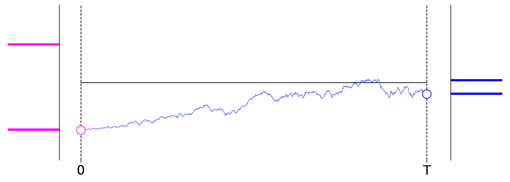

# Diffusion 101

- **Blog Post** &mdash; We wrote a [blog post](https://cgn.ai/blog/diffusion_101.html) about how to derive the simplified training loss without a detour through ELBO and KL-divergences.
- **Diffusion\_MNIST\_Experiment.ipynb** &mdash; We implemented a minimal diffusion model and train it to generate MNIST images.
- **Diffusion\_101\_Visualizations.ipynb** &mdash; Code to generate the 1-dimensional visualizations in our blog post.

Visual summary:

