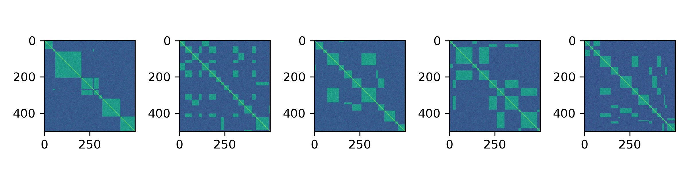
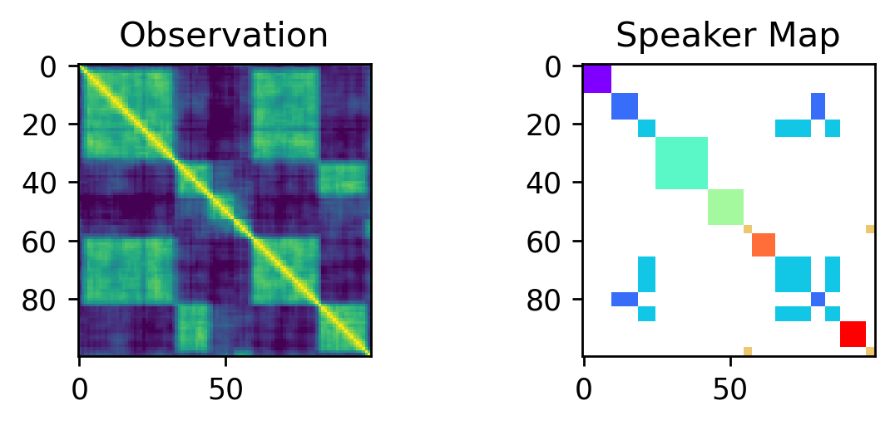

# Podverse

- **Speaker\_diarization\_in\_Gen.ipynb** &mdash; We built a probabilistic speaker segmentation model in [Gen](https://www.gen.dev/), a general-purpose probabilistic programming system, embedded in Julia.

Samples from our speaker similarity model:

Inference:

